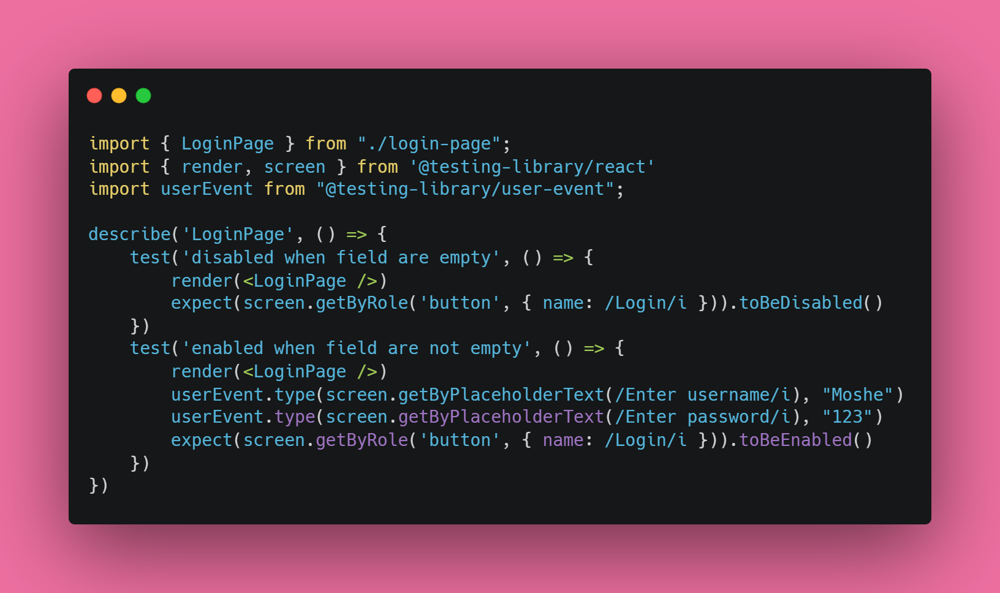
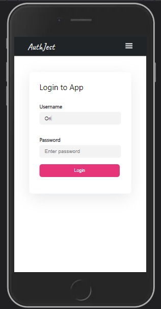


# Authentication Tests


I created this project, to feel how it's like to have tests with React. I did it because I want to have it before I create a big project with tests. In addition, I needed a reason to create a refference for a project that is based on react-v18 and router-v6...


## About the tests
So to create my small refference for tests, I chosed to implement it on the Login button.
I wanted this button to be ***disabled*** when the fields of the username and password are not both with content.

I guess the functionality isn't require explanation, but just to be fair I added an image that might clerify the move I tried to make here - [Scroll up to see](#authentication-tests).

And now for the tests:
I added the image above to help you follow along.
Basically I used jest amazing gifts, such as render, screen and user event in order to simulate a real DOM and user actions, and to see if it is indeed follow my expectations...


## Getting started
Clone the project or dowload the files on top.
```
git clone https://github.com/OriBenAmram/LoginWithTests.git
```
Open the terminal and enter the following lines to run it locally on your computer:
```
npm i
npm start
```
Runs the app in the development mode. Open http://localhost:3000 to view it in the browser (it is supposed to happen automatically).

Now, to see some tests, run this line:
```
npm run test
```
You supposed to see that the tests are running (in the terminal), and two out of two should be passed. 
